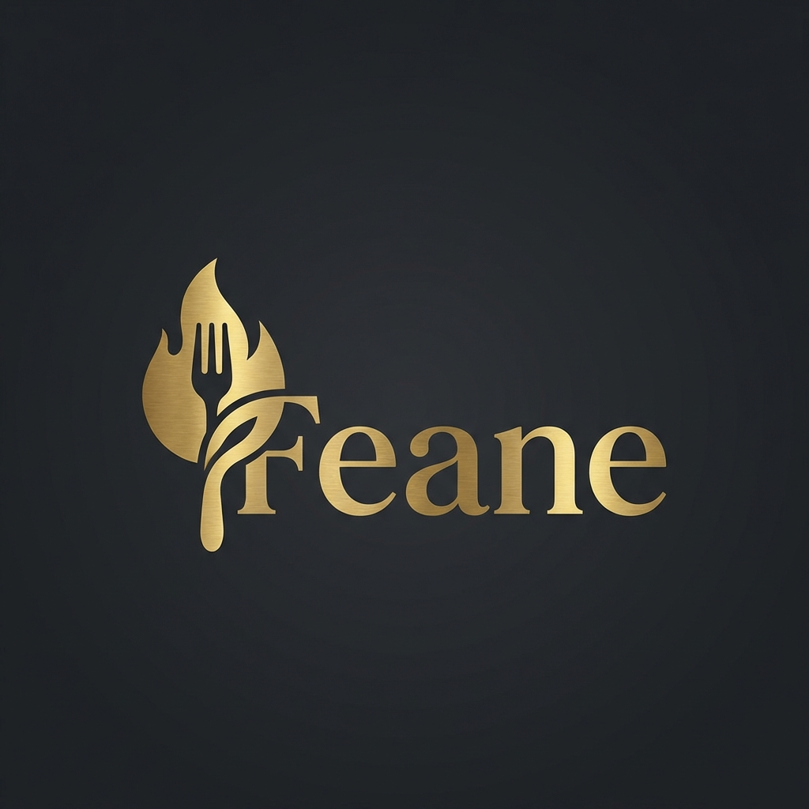

# Feane | Ultra-Premium Dining Experience 🍷



> **Where Culinary Art Meets Timeless Elegance.**
> A next-generation dining platform built for performance, aesthetics, and commercial viability.

[](https://react.dev/)
[](https://vitejs.dev/)
[](https://tailwindcss.com/)
[](https://www.framer.com/motion/)

## ✨ The Vision

**Feane** has been transformed from a standard template into a bespoke, high-performance web application. Designed to capture the essence of luxury dining, it combines immersive visuals with seamless user interactions.

### 🌟 Key Features

-   **💎 Glassmorphism UI**: A modern, frosted-glass aesthetic for navigation and overlays.
-   **🎭 Parallax Hero Section**: Immersive first impressions with scroll-driven depth.
-   **⚡ Blazing Fast Performance**: Powered by Vite and optimized React components.
-   **📱 Mobile-First Design**: Flawless experience across all devices.
-   **🍛 Interactive Menu**: Smooth filtering and hover effects for a tactile browsing experience.
-   **📅 Streamlined Reservation**: A multi-step, user-friendly booking flow.

## 🛠 Tech Stack

-   **Core**: [React](https://react.dev/) + [Vite](https://vitejs.dev/)
-   **Styling**: [Tailwind CSS](https://tailwindcss.com/) (Custom Design System)
-   **Animations**: [Framer Motion](https://www.framer.com/motion/)
-   **Icons**: [Lucide React](https://lucide.dev/)
-   **Typography**: Playfair Display (Serif) & Inter (Sans)

## 🚀 Quick Start

1.  **Clone the Repository**
    ```bash
    git clone https://github.com/gideongeny/Feane.git
    cd Feane
    ```

2.  **Install Dependencies**
    ```bash
    npm install
    ```

3.  **Run Development Server**
    ```bash
    npm run dev
    ```

4.  **Build for Production**
    ```bash
    npm run build
    ```

## 🎨 Design System

Our design philosophy revolves around "Dark Luxury":
-   **Primary**: `#fbfbbe` (Cream Gold)
-   **Secondary**: `#222831` (Deep Charcoal)
-   **Accents**: `#d4af37` (Metallic Gold)

## 🤝 Contributing

Contributions are welcome from those who appreciate fine code and fine dining.

1.  Fork the Project
2.  Create your Feature Branch (`git checkout -b feature/AmazingFeature`)
3.  Commit your Changes (`git commit -m 'Add some AmazingFeature'`)
4.  Push to the Branch (`git push origin feature/AmazingFeature`)
5.  Open a Pull Request

---

*Crafted with precision by Gideon Ngeno.*
